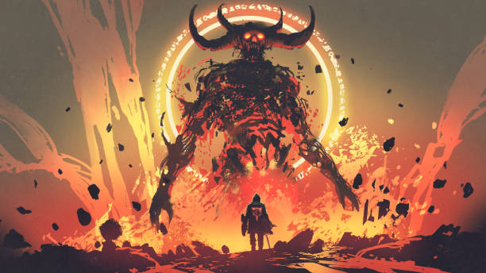
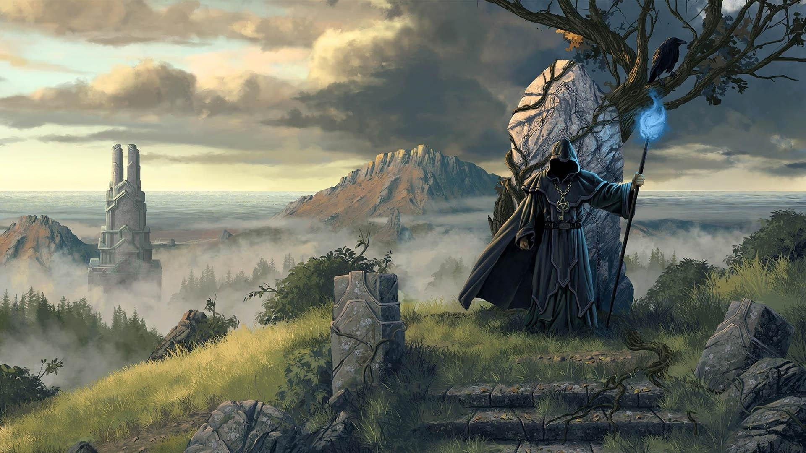

# Interactive Story-part1

## Table of content
  - [Description](#description)
  - [How it works](#how-it-works)
  - [Scrennshots](#scrennshots)
  - [Content](#content)
  - [Technology](#technology)
  - [Install](#install)
  - [Team](#team)

## Description 
After the world was drowned with sins and iniquity, the God decided to punish us with their serve torment, with diseases and Demons invading the glove.

In this game, you are the Wizard Balco who has choosen his path to deticate his life to kill the Demons in order to heal the patients from their illness and free them from curses.

Kill the Demons and collect the missing items to save the widow mother from her deadly disease. But becareful on your way, becareful not to be the vitim of Greed, the victim of betrayal, or the victim of your weakness.

## How it works ##
[Script](https://github.com/Nourcova/Interactive_story/blob/master/Beyond%20Darkness.pdf)
## Scrennshots

## Content 
Our projecct contains:
1. A script (stoy of the game as pdf file) ((https://github.com/Nourcova/Interactive_story/blob/master/Beyond%20Darkness.pdf)
2. A graph to explain the game script, how it works, different branches and the ending (https://github.com/Nourcova/Interactive_story/blob/master/Beyond%20Darkness.svg)
2. A readme to explain more the project
4. images that should be included in the story (https://github.com/Nourcova/Interactive_story/tree/master/images)
5. A web page (html, css) that represents the story with different scenarios/branches (https://github.com/Nourcova/Interactive_story/blob/master/index.html)

## Technology 
The Technologies used in this project:
1. For the graph (draw.io)
2. For the web page (html/css)

## Install
1. Fork it to your repository
2. Clone it to your local machine

## Team
1. [Rima Assaad](https://github.com/rimamohamedassaad)
2. [Ibrahim Nour](https://github.com/Nourcova)
3. [Hodhod](https://github.com/hodhod0)
